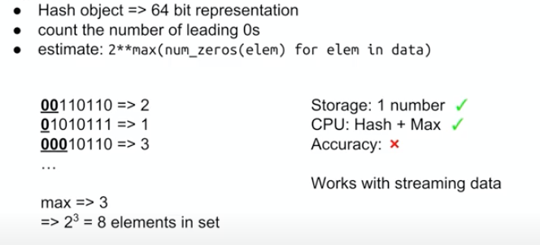
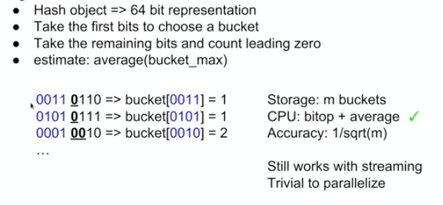
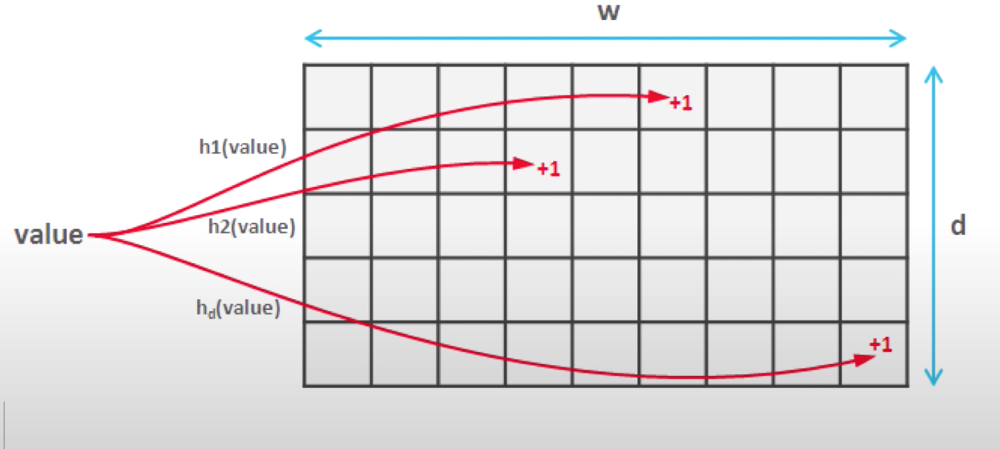
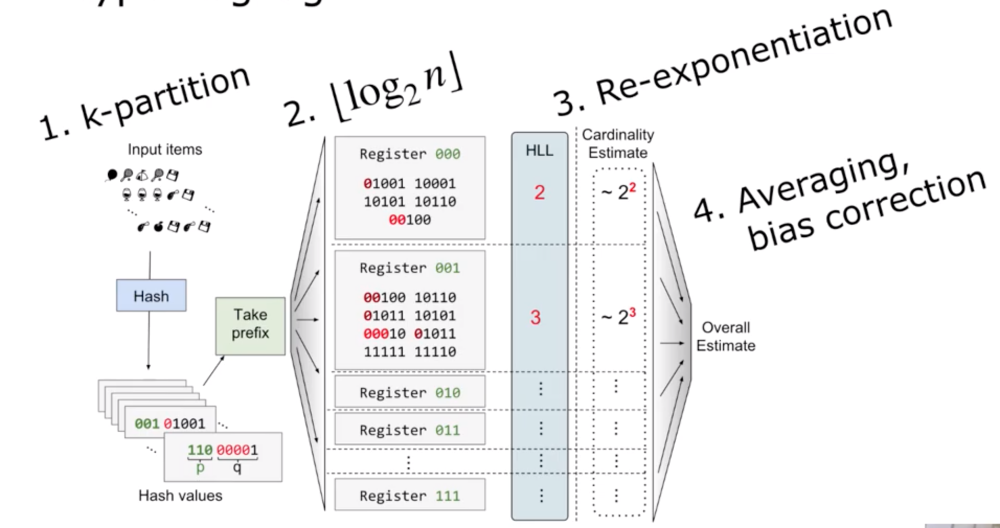
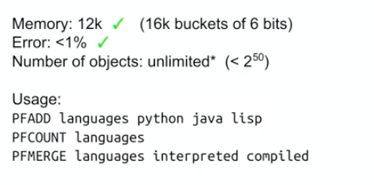

# Functional Requirements
- Number of unique users connected to app at given point of time
# Brute force approach 
- Store connection and user unique id in the database as per following schema 
```
{
    connectionId: int
    userId: int
    state: string # active, closed
}
```
We can run following SQL query to get unique userids
```
SELECT distinct(userId)
FROM Connections
WHERE state = 'active'
```
- Time complexity `O(n)`
- Space complexity: `O(n)`
# Optimize Brute force approah 
- Maintain in memory Set to store all unique user id
- Also maintain the global counter variable
- Following will be flow
    - if userid exist in userIds set, do nothing
    - if userid doesn't exist in userIds set then add it and also increase counter
    - if userid is suppose to delete then delete from set and reduce counter
- Time complexity `O(1)`
- Space complexity: `O(n)`
Following are problems
- Single server bottleneck
# Improve Brute force furhter to add more servers
- Add more servers
- each server will store uniqe userids set 
- There will be a central server which will read userids from all other server, perform the count
Note: This has many flaw, it will not work.
# Hyperloglog Algorithm
## Summary
- This is an approximation algorithm 
- ObjectID should be uniformally distributed and random
- Apply hash functon on objectID to generate `64` bit number
## Hyperloglog API
```
class HLL {
    void add(element) {

    }
    int cardinalaity() {

    }
}
```
## Accuracy of Hyperloglog
- estimates cardinalaities well beyond 10^9 with a typical accuracy of 2% while using a memory of only 1.5kb

## Probability on binary number
Note: Assumption is that userId is uniformaly distributed
- Probability of last digit will be `0`: 1/2
- Probability of last digits will be `00`: 1/4
- Probability of last digits will be `000`: 1/8
- Probability of last digits will be x times `0`: 1/(2^x)

Similary, we can have following 
- Probability of leading digit will be `0`: 1/2
- Probability of leading digits will be `00`: 1/4
- Probability of leading digits will be `000`: 1/8
- Probability of leading digits will be x times `0`: 1/(2^x)
## Hyperloglog basic steps
- hash(objectId) => 64 bit representation
- count the number of leading `0`
- estimate : 2^max(num_zeros(elem) for elem in data)


## Improve Hyperloglog accuracy
- Use first 4 bits to choose bucket
- For rest of bits, apply HLL basic steps
- Each bucket only stores the maxumum length of `0` leading sequence
- Take the average of each bucket_max `avg`
- Total number will be `2^avg`
- You can do parallel operations on each bucket and then use central server to get results from each bucket to calculate result


## Use of multi hash functuoin to improve accuracy 
- This is based on count min sketch algorithm
 

## Overall architecture

## Hyperloglog implementation in Redis
- Redis has implementation of Hyperloglog



# Reference 
https://www.youtube.com/watch?v=eV1haPUt0NU&t=583s&ab_channel=GauravSen

https://www.youtube.com/watch?v=jD2d7jr7z1Q

https://www.youtube.com/watch?v=1y9wqQUTvC4&ab_channel=BenLangmead

http://algo.inria.fr/flajolet/Publications/FlFuGaMe07.pdf